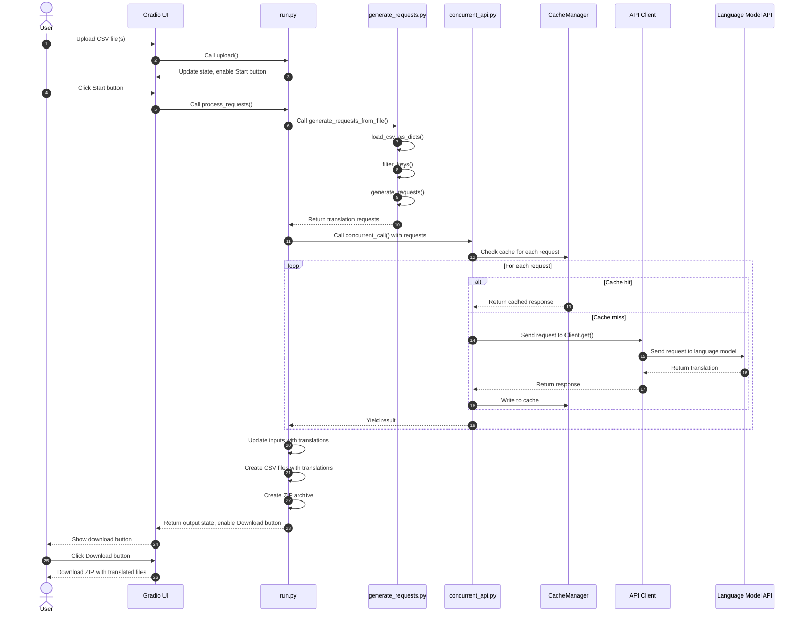

```mermaid
sequenceDiagram
    autonumber
    actor User
    participant GradioUI as Gradio UI
    participant RunPy as run.py
    participant GenReq as generate_requests.py
    participant ConcAPI as concurrent_api.py
    participant Cache as CacheManager
    participant APIClient as API Client
    participant LLM as Language Model API

    User->>GradioUI: Upload CSV file(s)
    GradioUI->>RunPy: Call upload()
    RunPy-->>GradioUI: Update state, enable Start button
    
    User->>GradioUI: Click Start button
    GradioUI->>RunPy: Call process_requests()
    
    RunPy->>GenReq: Call generate_requests_from_file()
    GenReq->>GenReq: load_csv_as_dicts()
    GenReq->>GenReq: filter_keys()
    GenReq->>GenReq: generate_requests()
    GenReq-->>RunPy: Return translation requests
    
    RunPy->>ConcAPI: Call concurrent_call() with requests
    ConcAPI->>Cache: Check cache for each request
    
    loop For each request
        alt Cache hit
            Cache-->>ConcAPI: Return cached response
        else Cache miss
            ConcAPI->>APIClient: Send request to Client.get()
            APIClient->>LLM: Send request to language model
            LLM-->>APIClient: Return translation
            APIClient-->>ConcAPI: Return response
            ConcAPI->>Cache: Write to cache
        end
        ConcAPI-->>RunPy: Yield result
    end
    
    RunPy->>RunPy: Update inputs with translations
    RunPy->>RunPy: Create CSV files with translations
    RunPy->>RunPy: Create ZIP archive
    
    RunPy-->>GradioUI: Return output state, enable Download button
    GradioUI-->>User: Show download button
    
    User->>GradioUI: Click Download button
    GradioUI-->>User: Download ZIP with translated files
``` 