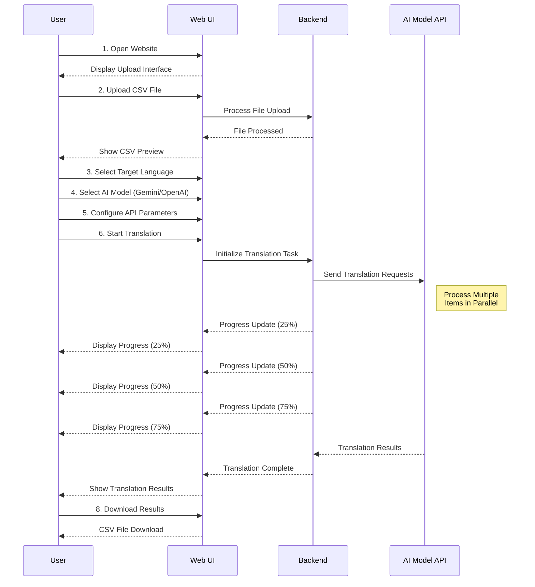

# Gemini Translate User Flow Sequence Diagram

Below is a sequence diagram that illustrates the complete user journey through the Gemini Translate application, from opening the website to downloading the translated results.

## Flow Description

1. **Website Access**: User opens the Gemini Translate web application
2. **Upload Data**: User uploads a CSV file containing product data for translation
3. **Configuration**: User selects target language, AI model, and sets API parameters
4. **Translation Initiation**: User starts the translation process
5. **Processing**: System processes translations in parallel, showing progress updates
6. **Completion**: Translation results are displayed to the user
7. **Download**: User downloads the translated CSV file

This sequence represents the complete user journey for the core translation workflow in Gemini Translate, supporting the affiliate marketing business model described in the business documentation. 