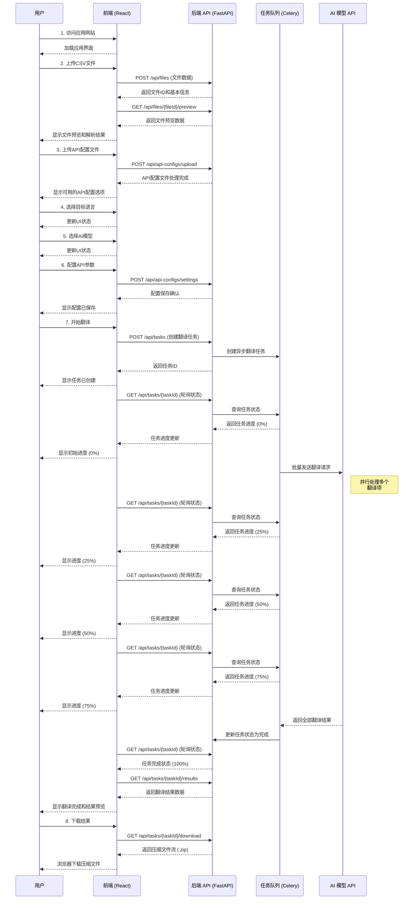

# Gemini Translate 前后端分离版本用户流程时序图

下面的时序图展示了Gemini Translate前后端分离版本中，用户从打开网页到下载翻译结果的完整交互流程。

## 流程说明

1. **访问应用**: 用户打开前端应用，加载React SPA界面
2. **上传数据**: 用户上传CSV文件，前端发送到后端API进行处理和预览
3. **上传API配置**: 用户上传API配置文件，系统加载可用的API选项
4. **选择翻译设置**: 用户选择目标语言、AI模型并配置API参数
5. **任务创建**: 前端通过API创建翻译任务，后端将任务加入队列
6. **状态轮询**: 前端定期轮询后端获取任务进度
7. **异步处理**: 后端任务队列管理与AI模型API的通信，并行处理翻译请求
8. **结果获取**: 翻译完成后，前端获取结果并展示给用户
9. **下载导出**: 用户下载结果，系统将翻译后的文件打包为压缩文件提供下载

此时序图反映了前后端分离架构的特点，包括明确的API调用、状态轮询机制以及任务队列的使用，这与原有的Gradio版本在交互模式上有显著区别。 